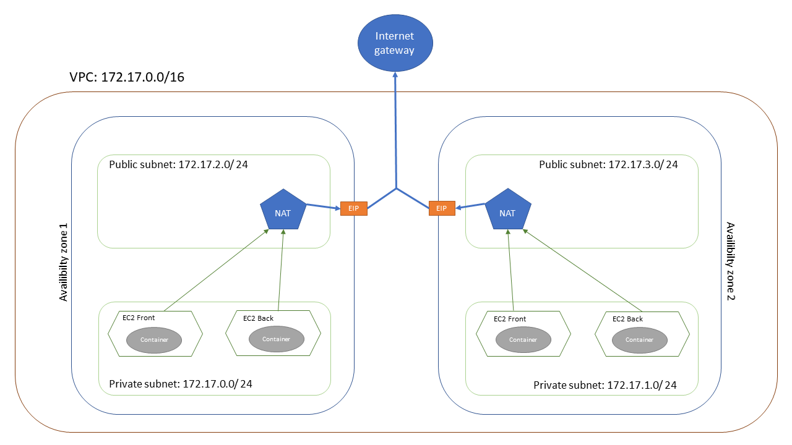

# ESGI JEE project

This project is configure to deploy a cloud infrastructure for a basket application

## Element deploy

This terraform is designed to create an ECS cluster, ECR registry and a load balancer.
ECS cluster is deployed in multiple availability zone (Minimum 2)
This project is designed to deploy a Spring boot basket api. To feet your needs you can update ``task_definitions_service.json``

## Required Parameters

1. ``prefix`` Prefix for your service

## Optional Parameters

1. ``az_count`` Number of availibilty zone (default 2)
2. ``container_env`` Map containing env variable for your container (Default empty). This map need to match you params on ``task_definitions_service.json``

## Output

1. ```api_app_url``` The url to call your new ECS service

## How to deploy

To deploy all the infrascture you only have to run terraform apply command. Then you need to push a docker image in the create ECR registry and force to deploy a new version on ECS

## Network infrastructure schema
You will find below the network infrastructure created by the project


